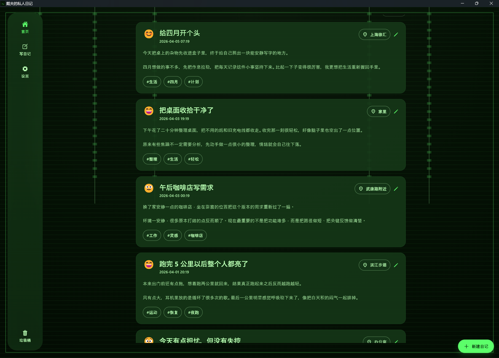
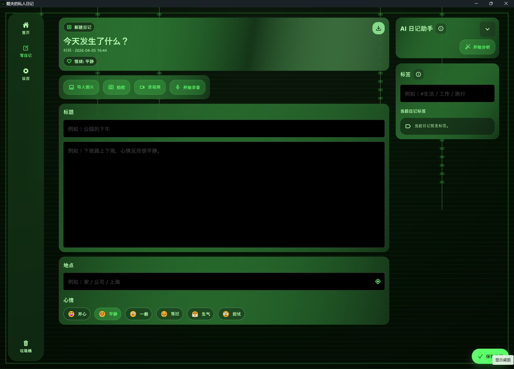
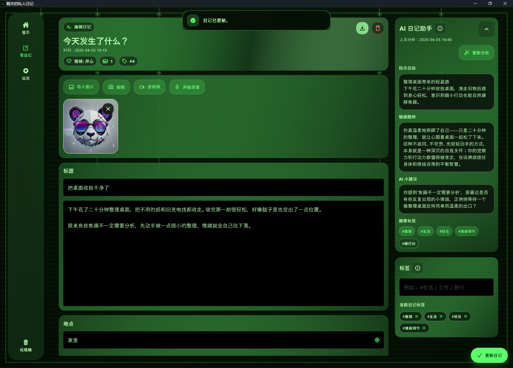
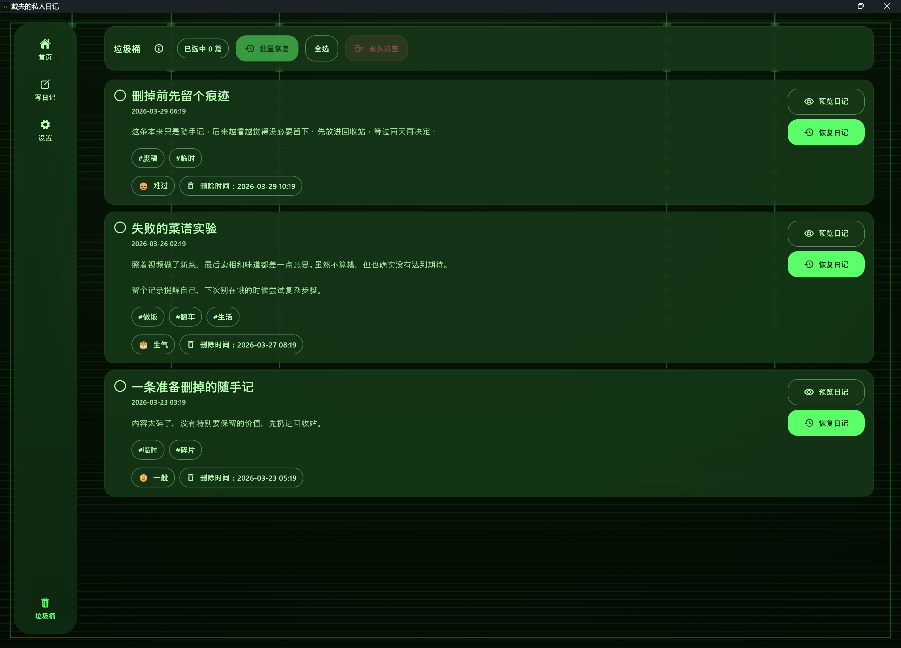
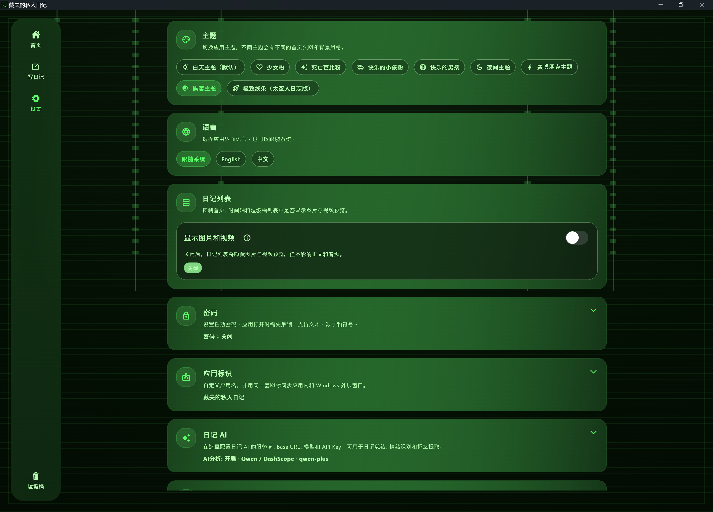

# Diary MVP

简体中文 | [English](./README.md)

Diary MVP 是一个以桌面端为主的 Flutter 日记应用，强调本地优先存储、隐私友好的个人记录体验，以及图文音视频结合的日记编辑能力。它在离线日记管理的基础上，提供可选的 AI 辅助分析、录音转文字和数据迁移能力，方便在不同设备之间迁移内容。

## 界面截图

### 首页



在首页查看最近日记、地点标签、心情状态和常用快捷操作。

### 写日记



创建包含标题、正文、心情、标签、地点，以及图片、视频、音频附件的日记内容。

### AI 日记助手



结合当前草稿查看 AI 生成的摘要、推荐标签、情绪陪伴文本和后续建议。

### 回收站



在回收站中预览已删除日记、恢复条目，或按需批量清理。

### 设置



集中管理主题、语言、启动密码、媒体显示、应用名称与图标、AI 配置和转写配置。

## 功能特性

- 基于 `drift` + SQLite 的本地优先日记存储
- 面向桌面端优化的导航结构和响应式布局
- 支持图片导入、拍照、视频录制、音频录制的富媒体日记编辑器
- 支持心情、标签和地点信息
- 提供时间轴视图，方便浏览全部日记
- 提供垃圾桶流程，支持预览、恢复、多选和永久清空
- 支持单篇日记导出为 Markdown 与纯文本，并复制关联媒体文件
- 支持完整迁移包导出与导入，覆盖日记、垃圾桶、媒体、标签和心情库
- 支持本地哈希保存的 6 位启动密码
- 支持基于 OpenAI 兼容聊天补全接口的 AI 日记分析
- 支持基于 `whisper-1` 的录音转文字
- 支持主题、语言、应用显示名称和应用图标自定义

## 技术栈

- Flutter
- Riverpod
- GoRouter
- Drift + SQLite
- `record`、`camera`、`media_kit`、`audioplayers`

## 项目结构

```text
lib/
  app/
  core/storage/
  features/diary/
test/
tools/
docs/
```

- `lib/app/`：应用外壳、路由、主题、本地化和启动锁
- `lib/core/storage/`：本地文件存储辅助逻辑
- `lib/features/diary/data/local/`：数据库层
- `lib/features/diary/presentation/`：页面和组件
- `lib/features/diary/services/`：AI、导出、迁移、转写、定位和设置相关服务

## 快速开始

### 环境要求

- Flutter SDK，Dart 版本需满足 `>=3.4.0 <4.0.0`

### 安装依赖

```bash
flutter pub get
```

### 在 Windows 上运行

```bash
flutter run -d windows
```

### 运行测试

```bash
flutter test
```

## AI 与录音转写

AI 分析和录音转写都是可选功能。

- AI 分析可在应用设置中配置，支持 OpenAI 兼容的聊天补全服务
- 应用内置了 Qwen / DashScope、OpenAI、Claude 兼容层、Gemini 兼容层、OpenRouter 和自定义提供商预设
- 录音转写使用 OpenAI `whisper-1`
- API Key 既可以保存在应用设置里，也可以在启动时通过 Dart Define 传入

示例：

```bash
flutter run -d windows ^
  --dart-define=DIARY_AI_API_KEY=your_ai_key ^
  --dart-define=OPENAI_API_KEY=your_openai_key
```

应用使用的环境变量回退键：

- `DIARY_AI_API_KEY`
- `DASHSCOPE_API_KEY`（兼容旧配置）
- `OPENAI_API_KEY`

## 本地数据路径

应用数据会写入系统的应用文档目录下：

- `diary_mvp/db/diary.db`
- `diary_mvp/user_data/diary/images/`
- `diary_mvp/user_data/diary/audio/`
- `diary_mvp/user_data/diary/video/`
- `diary_mvp/user_data/trash/`
- `diary_mvp/settings/`

## 打包发布

### Windows 安装包

```powershell
powershell -ExecutionPolicy Bypass -File .\tools\build_windows_installer.ps1
```

### macOS DMG

需要在 macOS 或 macOS CI 环境中执行。

```bash
chmod +x ./tools/build_macos_installer.sh
./tools/build_macos_installer.sh
```

构建产物输出位置：

- `dist/windows-installer/*.exe`
- `dist/macos-installer/*.dmg`

如果需要在 CI 中同时产出安装包，可以使用 `.github/workflows/build_desktop_installers.yml`。

## 开源协议

本项目采用 [MIT 协议](./LICENSE) 开源。
